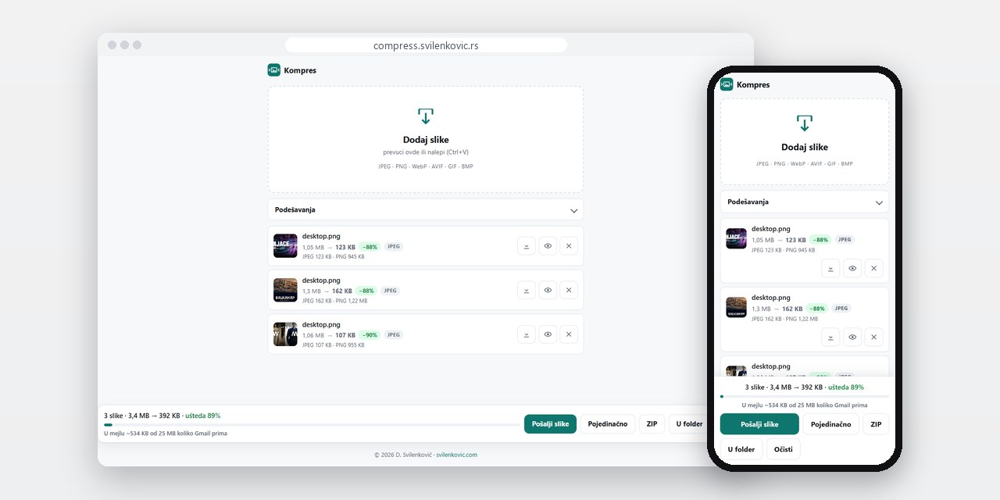
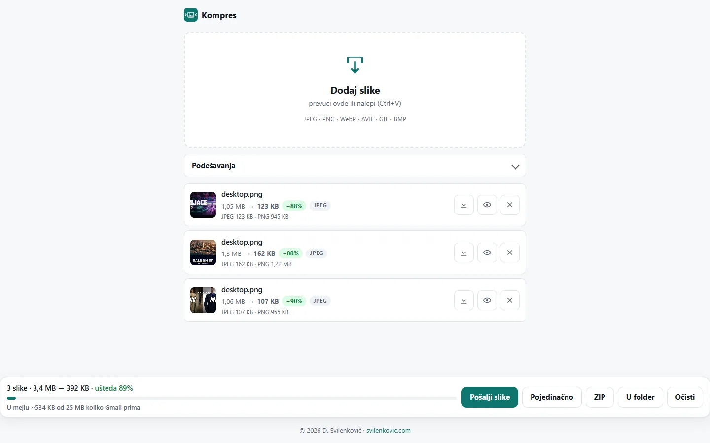
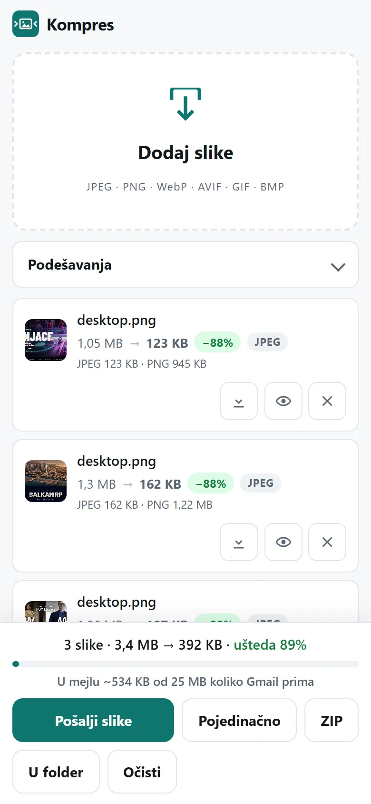

# Kompres

Alat u pregledaču koji smanjuje grupu JPEG, PNG, WebP i AVIF slika na samom uređaju, sa posebnim režimima za mejl i za sajt.

**[compress.svilenkovic.rs](https://compress.svilenkovic.rs/)** · [Stranica aplikacije](https://svilenkovic.rs/aplikacija-kompres) · [English](README.md)

> [!NOTE]
> Moj sopstveni proizvod. Izvorni kod je privatan. Ova stranica opisuje šta radi i kako je napravljen.

<table>
  <tr><td><b>Klijent</b></td><td>Sopstveni proizvod</td></tr>
  <tr><td><b>Delatnost</b></td><td>Alat za kompresiju slika</td></tr>
  <tr><td><b>Lokacija</b></td><td>Srbija</td></tr>
  <tr><td><b>Vrsta</b></td><td>Web aplikacija (PWA)</td></tr>
  <tr><td><b>Moj deo posla</b></td><td>Dizajn, izrada i hosting</td></tr>
  <tr><td><b>Tehnologije</b></td><td>TypeScript, Vite, Web Workers, WebAssembly, PWA</td></tr>
</table>

## O projektu

Kompres je moj alat za smanjivanje slika pre nego što odu u mejl ili na sajt. Grupa slika se prevuče ili nalepi, izabere se režim, a rezultati se preuzimaju pojedinačno, kao ZIP ili pravo u folder. Server samo isporučuje aplikaciju, a slike ne napuštaju uređaj.

Svaka slika se kodira na više načina i ostaje najmanji rezultat. MozJPEG, WebP, AVIF i OxiPNG se nadmeću u zavisnosti od režima i od toga da li slika ima providnost, a ako nijedan ne ispadne manji od originala, ostaje original. Režim za mejl drži se JPEG-a i PNG-a, koje mejl programi prikazuju u samoj poruci. Posebno dugme spušta dimenzije i kvalitet dok cela grupa ne stane u granicu od 25 MB za jedan Gmail mejl.

## Šta sam uradio

- WebAssembly kodeci u Web Workerima, a broj workera zavisi od jezgara i memorije uređaja, pa interfejs ne koči
- Četiri režima (za mejl, pametno, bez gubitka i agresivno), uz kontrolu kvaliteta i najveće dimenzije
- Prima JPEG, PNG, WebP, AVIF, GIF i BMP, prevlačenjem ili lepljenjem
- Klizač pre i posle za poređenje svakog rezultata sa originalom
- Preuzimanje pojedinačno, kao ZIP ili u izabrani folder, gde pregledač to dozvoljava
- PWA koja se instalira, radi bez interneta i na Androidu se pojavljuje u meniju za deljenje slika

## Merenja

| | Performanse | Pristupačnost | Dobre prakse | SEO |
| :-- | :-: | :-: | :-: | :-: |
| Telefon | 100 | 96 | 100 | 100 |
| Desktop | 100 | 96 | 100 | 100 |

Lighthouse, laboratorijsko merenje živog sajta, septembar 2026.

## Snimci ekrana

<table>
  <tr>
    <td width="68%" valign="top"></td>
    <td width="32%" valign="top"></td>
  </tr>
</table>

---

Izrada: [D. Svilenković](https://svilenkovic.rs).
